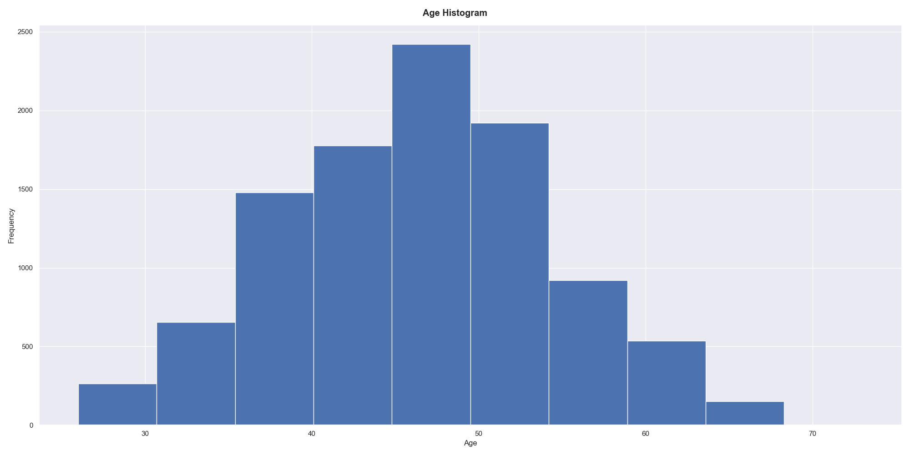
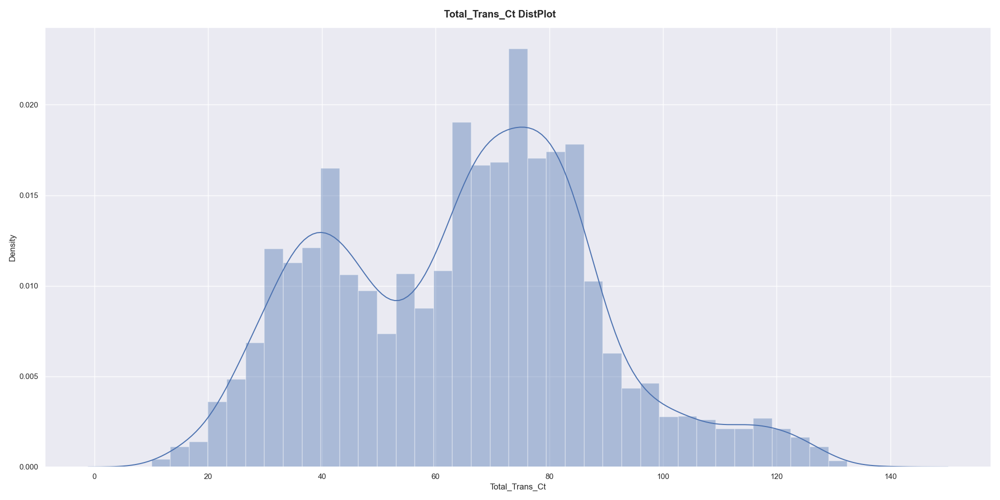
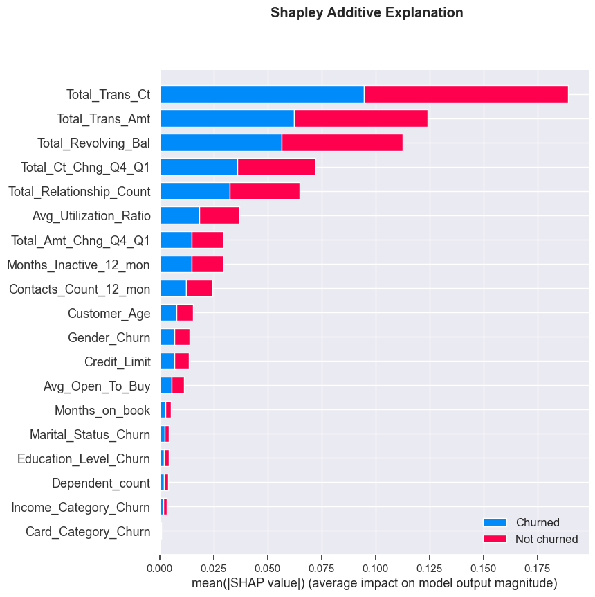
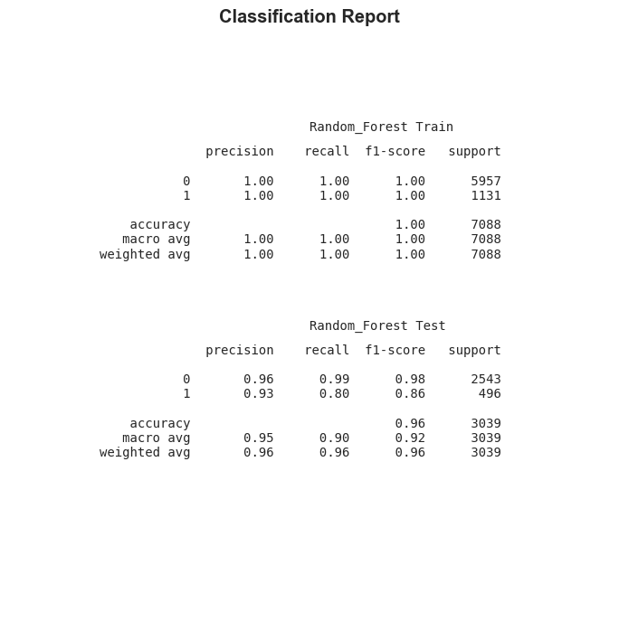

<h1>Predicting Customer Churn with Clean Code</h1>
<h2> Table of Contents</h2>
<!-- TOC -->

- [Overview](#overview)
- [Project Setup and Installation](#project-setup-and-installation)
- [Project Steps](#project-steps)
    - [Data Ingestion](#data-ingestion)
    - [Exploratory Data Analysis (EDA)](#exploratory-data-analysis-eda)
        - [Age Distribution Plot](#age-distribution-plot)
        - [Total Transactions Completed Density Plot](#total-transactions-completed-density-plot)
    - [Data Preprocessing](#data-preprocessing)
    - [Model Training & Evaluation](#model-training--evaluation)
        - [Random Forest SHAP Summary Plot](#random-forest-shap-summary-plot)
        - [Random Forest Classification Report](#random-forest-classification-report)
- [Tests](#tests)

<!-- /TOC -->

## Overview
This project builds a system to help companies identify credit card customers that are most likely to churn. This churn prediction system is based on the churn prediction solution contained in the [churn_notebook.ipynb](churn_notebook.ipynb). Thus, this projects achieves the following:
- Refactoring the code contained in the notebook.
- Modularising the solution so that individual functionalities and the system can be maintained/extended as necessary
- Unit tests (see [Tests](#tests)) for the functions that this system relies upon

Additionally, this project follows the `PEP 8` Style Guide as closely as possible. All scripts exceed 8 when scored with `pylint`. This can be verified using `main.py` and `churn_library.py` as examples
```
$ pylint main.py
$ pylint src/churn_library.py
```

## Project Setup and Installation
- Create an environment from environment.yml
```
$ conda env create -f environment.yml
```
- Run tests for the project and check the [log file](logs/churn_library.log) for test logs.
```
$ python -m unittest
```
- You can run the project using `main.py` as follows. Information about results are provided in sections below.
```
$ python main.py --data-path 'data/bank-data.csv'
```
- Hack away! 🔨 🔨

## Project Steps

### Data Ingestion
The dataset for training is ingested using the `import_data` function in [churn_library.py](src/churn_library.py). This function also creates the target variable - `Churn` as follows:
```
data['Churn'] = data['Attrition_Flag'].apply(
        lambda val: 0 if val == 'Existing Customer' else 1
    )
```

### Exploratory Data Analysis (EDA)
Five plots are created during EDA:
- A histogram showing the `Churn` distribution
- A histogram showing the `Age` distribution
- A bar chart showing the `Marital Status` distribution
- A density+histogram plot showing `Total Transactions Completed`
- A correlation heatmap for the dataset
For modularity, each plot is created by a function in [plots.py](src/plots.py). They are imported for use in [churn_library.py](src/churn_library.py) as necessary. All plots are saved to [eda](images/eda) directory. Some of them are shown below.

#### Age Distribution Plot


#### Total Transactions Completed Density Plot


### Data Preprocessing
The major preprocessing that occurs before model training is the encoding of categorical columns. `Target encoding` is employed here: categorical values are replaces with the mean of the target variable. For efficiency, this calculation takes advantage of pandas dataframe `transform` method. See `encoder_helper` in [churn_library.py](src/churn_library.py). The full list of columns to be encoded in this step are contained in [main.py](main.py) (see `CAT_COLS`) and can be changed as necessary.

### Model Training & Evaluation
Two models are trained: `Logistic Regression` and `Random Forest`. Prior to training, feature selection is done. Here, it is implemented simply as list of features (`KEEP_COLS`) contained in [main.py](main.py). This allows for a more involved feature selection process to be implemented in the future without need for extensive refactoring so long as it produces a list of features as output.

The logic that trains both models is contained in `train_model` function of [churn_library.py](src/churn_library.py). While the `Logistic Regression` model is simply fitted on the data, the best `Random Forest` model is found by `GridSearch`. To facilitate this, a parameter grid is provided in `main.py` and can be changed as desired. Both trained models are persisted to the [models](models) directory. This function returns both the fitted models and their predictions for use in evaluation.

Model evaluation involves the the creation of `classification report` and `Receiver-Operating-Characteristic` plots. These plots are saved to the [results](images/results) directory. Additionally, the `Random Forest` model is explained using [Shapley Additive Explanations (SHAP)](https://github.com/slundberg/shap). SHAP values help relate the impact of a certain value for a given feature to a prediction baseline (usually the average of all predictions). A SHAP summary plot, as well as a feature importances plot, is thus produced.

#### Random Forest SHAP Summary Plot


#### Random Forest Classification Report


## Tests
The advised way to test this project is
```
$ python -m unittest
```
For testing, this project relies on python's `unittest` library. All tests are contained in [test_churn_library.py](tests/test_churn_library.py). Two fixtures are also provided in the `tests` directory to enable testing:
- test_data.txt: A sample dataset of 10 columns
- encoded_columns.txt: A sample result of encoded categorical columns

`Logging` occurs during testing. Logs are written to [churn_library.log](logs/churn_libary.log). In order to aid debugging, the log messages contain information about the error a functions contains. If no error exists, the log reports the success of the test.
